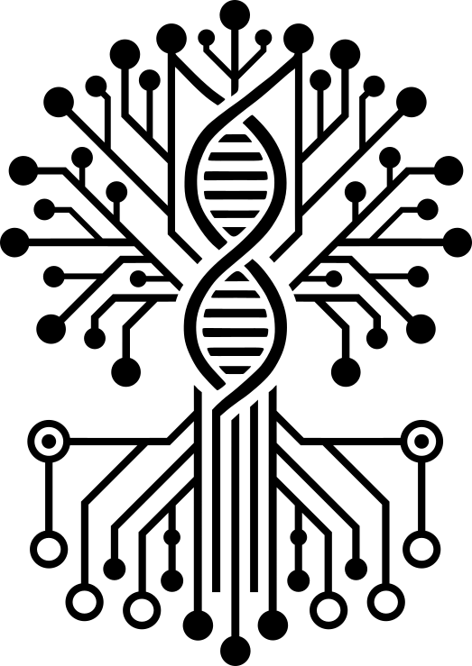

<div align="center">
  <picture>
  <source media="(prefers-color-scheme: dark)" srcset="docs/assets/ygg_logo-dark_mode.png">
  <source media="(prefers-color-scheme: light)" srcset="docs/assets/ygg_logo-light_mode.png">
  
</picture>
</div>

# Yggdrasil

[](https://github.com/glrs/yggdrasil/releases)
&nbsp;
[](https://app.codacy.com/gh/glrs/Yggdrasil/dashboard?utm_source=gh&utm_medium=referral&utm_content=&utm_campaign=Badge_coverage)
&nbsp;
[](https://app.codacy.com/gh/glrs/Yggdrasil/dashboard?utm_source=gh&utm_medium=referral&utm_content=&utm_campaign=Badge_grade)

> **Automate anything — traceable plans, reproducible runs.**

Yggdrasil is an event-driven orchestration framework for automating well-defined workflows. It watches CouchDB databases and file-system paths for changes, routes events to **realm modules**, and executes the resulting workflow plans via the **Engine**.

**→ [Full documentation](docs/index.md)**

---

## Quickstart

```bash
# Clone and install (dev)
git clone https://github.com/NationalGenomicsInfrastructure/Yggdrasil.git
cd Yggdrasil
conda create -n ygg-dev python=3.11 pip && conda activate ygg-dev
pip install -e .[dev]

# Run the daemon
yggdrasil --dev daemon

# Or process a single document
yggdrasil run-doc <DOC_ID>
```

See [docs/getting_started/quickstart.md](docs/getting_started/quickstart.md) for full installation, configuration, and CLI reference.

---

## Project structure

| Path | Contents |
|------|---------|
| `yggdrasil/` | Public API: `flow/` (execution framework), `cli.py`, `core/` |
| `lib/` | Internal implementation: core, watchers, CouchDB, realm handlers |
| `lib/realms/` | Internal realm implementations and `test_realm` (dev-only) |
| `tests/` | Test suite (1700+ tests) |
| `docs/` | Documentation |

Realms are the extension point for domain-specific workflow logic. External realms self-register via the `ygg.realm` entry-point group. See [docs/realm_authoring/guide.md](docs/realm_authoring/guide.md).

---

## Contributing

Contributions are welcome. Open pull requests against the `dev` branch. Format with `black`, lint with `ruff`, type-check with `mypy`. Run `pre-commit install` so hooks fire automatically on commit.

## License

MIT — see [LICENSE](LICENSE).
